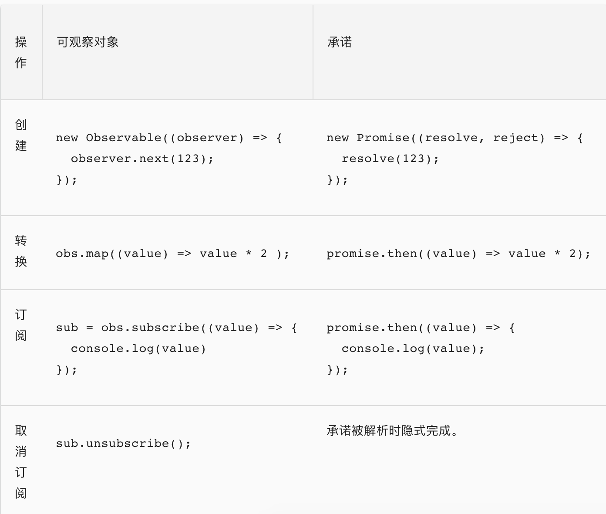
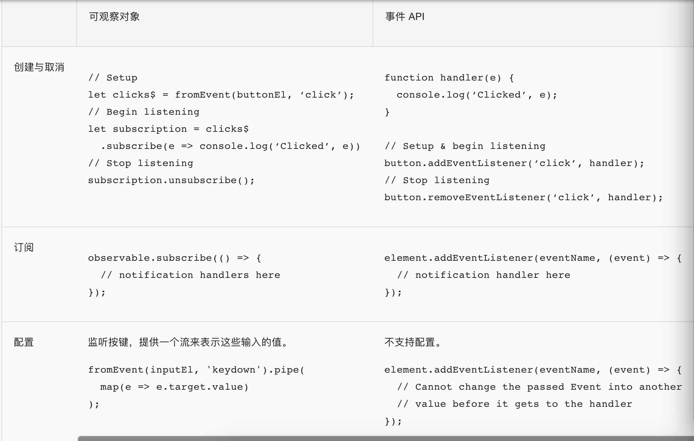
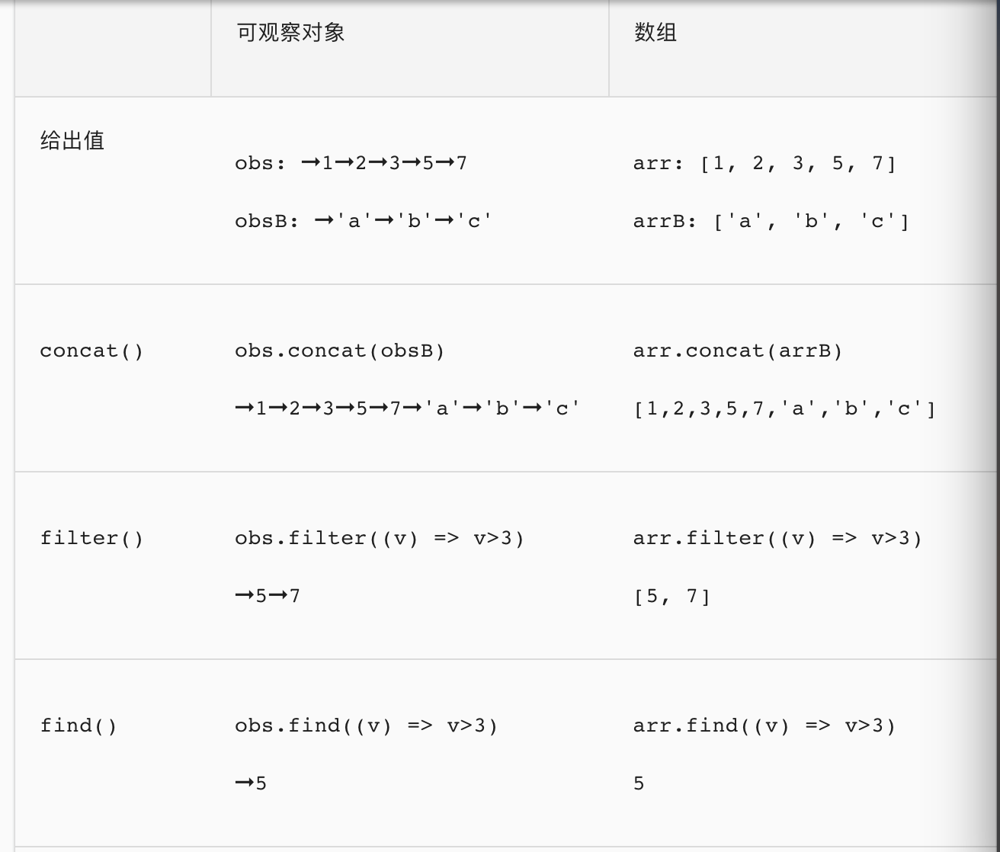

# rxjs初体验及其适用性讨论

##  Rxjs是什么
RxJS全名是 Reactive Extensions for JavaScript: Javascript的响应式扩展，是一个基于可观测数据流在异步编程应用中的Library(可以认为rxjs是处理异步行为的lodash)，可以和任何视图层框架混用。

## 响应式编程(RP: Reactive programming)
响应式的思路：是把随时间不断变化的数据、状态、事件等等转成可被观察的序列(Observable Sequence)，然后订阅序列中那些Observable对象的变化，一旦变化，就会执行事先安排好的各种转换和操作。

举个栗子：比如说，abc三个变量之间存在加法关系：
```
a = b + c
```
在传统方式下，这是一种一次性的赋值过程，调用一次就结束了，后面b和c再改变，a也不会变了。

而在Reactive的理念中，我们定义的不是一次性赋值过程，而是可重复的赋值过程，或者说是变量之间的关系：
```
a: = b + c
```
定义出这种关系之后，每次b或者c产生改变，这个表达式都会被重新计算。不同的库或者语言的实现机制可能不同，写法也不完全一样，但理念是相通的，都是描述出数据之间的联动关系。
## 为什么Rxjs
### 异步常见的问题

* 竞争条件(Race Condition)
* 内存泄漏(Memory Leak)
* 复杂的状态(Complex State)
* 异常处理(Exception Handling)
### 各种不同的API
* DOM Events
* XMLHttpRequest
* fetch
* WebSockets
* Timer
* Server Send Events
* Service Worker
* Node Stream

## 先来看一个例子：远程搜索功能

一般的实现方式是：监听文本框的输入事件，将输入内容发送到后台，最终将后台返回的数据进行处理并展示成搜索结果。
```
<input id="text"></input>
<script>
    var text = document.querySelector('#text');
    text.addEventListener('keyup', (e) =>{
        var searchText = e.target.value;
        // 发送输入内容到后台
        $.ajax({
            url: `search.qq.com/${searchText}`,
            success: data => {
              // 拿到后台返回数据，并展示搜索结果
              render(data);
            }
        });
    });
</script>
```
上面代码实现我们要的功能，但存在两个较大的问题：

多余的请求:
当想搜索“vue”时，输入框可能会存在三种情况，“v”、“vu”、“vue”。而这三种情况将会发起 3 次请求，存在 2 次多余的请求。

已无用的请求仍然执行:
一开始搜了“vue”，然后马上改搜索“Angular”。结果后台返回了“vue”的搜索结果，执行渲染逻辑后结果框展示了“vue”的结果，而不是当前正在搜索的“Angular”，这是不正确的。

减少多余请求数，可以用 setTimeout 函数去抖动的方式来处理，核心代码如下
```
<input id="text"></input>
<script>
    var text = document.querySelector('#text'),
        timer = null;
    text.addEventListener('keyup', (e) =>{
        // 在 250 毫秒内进行其他输入，则清除上一个定时器
        clearTimeout(timer);
        // 定时器，在 250 毫秒后触发
        timer = setTimeout(() => {
            console.log('发起请求..');
        },250)
    })
</script>
```
已无用的请求仍然执行的解决方式，可以在发起请求前声明一个当前搜索的状态变量，后台将搜索的内容及结果一起返回，前端判断返回数据与当前搜索是否一致，一致才走到渲染逻辑。最终代码为
```
<input id="text"></input>
<script>
    var text = document.querySelector('#text'),
        timer = null,
        currentSearch = '';
 
    text.addEventListener('keyup', (e) =>{
        clearTimeout(timer)
        timer = setTimeout(() => {
            // 声明一个当前所搜的状态变量
            currentSearch ＝ '书'; 
 
            var searchText = e.target.value;
            $.ajax({
                url: `search.qq.com/${searchText}`,
                success: data => {
                    // 判断后台返回的标志与我们存的当前搜索变量是否一致
                    if (data.search === currentSearch) {
                        // 渲染展示
                        render(data);
                    } else {
                        // ..
                    }
                }           
            });
        },250)
    })
</script>
```
上面代码基本满足需求，但代码开始显得乱糟糟。我们来使用 RxJS 实现上面代码功能，如下
```
const { fromEvent } = require('rxjs')
const { debounceTime, pluck, switchMap, subscribe } = require('rxjs/operators')

var text = document.querySelector('#text')
fromEvent(text, 'keyup').pipe(
  debounceTime(250),
  pluck('target', 'value'),
  switchMap(searchText => Http.get(`search.qq.com/${searchText}`))
).subscribe(data => render(data))                 
```
一些理解：把（已经发生或者将要发生的）某组事件（通过某种规则）转化成另一组事件，最终对其进行订阅的库。

同样环境下要完成同样的目标时……通常的思考方式是：

当什么事件发生了，就去做什么，改变什么状态，触发或延迟触发另外的事件，然后如何处理这些事件……事无巨细地去描述自己要一步步做什么。

RxJS的思考方式是：如何把这组事件转化成另一组事件，再转化成下一组事件，最终得到一组真正有用的事件并订阅它。
## rxjs6.0的模块化
* index文件 提供Observable、Subject等核心类和一些静态操作符方法
```
const { Observable, fromEvent } = require('rxjs')
```
* rxjs/operators目录 提供所有核心操作符（对应v5.0的实例操作符）
```
const { debounceTime, switchMap } = require('rxjs/operators')
```
* pipe操作符 管道操作符，定义在Observable实例上唯一的操作符

##  RxJS · 流 Stream
学习 RxJS，我们需要从可观测数据流(Streams)说起，它是 Rx 中一个重要的数据类型。
流是在时间流逝的过程中产生的一系列事件，它具有时间与事件响应的概念。在前端领域中，DOM事件、WebSocket获得服务端的推送消息、AJAX获取服务端的数据资源（这个流可能只有一个数据）、网页动画显示等等都可以看成是数据流。

## Observable 和 Observer
* Observable (可观察对象): 表示一个概念，这个概念是一个可调用的未来值或事件的集合。
* Observer (观察者): 一个回调函数的集合，它知道如何去监听由Observable 提供的值。
### Observable 剖析
Observables 是使用 构造函数Observable 或创建操作符创建的，并使用观察者来订阅它，然后执行它并发送 next / error / complete 通知给观察者，而且执行可能会被清理。这四个方面全部编码在 Observable 实例中，但某些方面是与其他类型相关的，像 Observer (观察者) 和 Subscription (订阅)。

Observable 的核心关注点：

* 创建 Observable
* 订阅 Observable
* 执行 Observable
* 清理 Observable

#### 创建可观察对象Observable
* 通过构造函数
```
import { Observable } from 'rxjs';

function sequenceSubscriber(observer) {
   try {
    observer.next(1);
    observer.next(2);
    observer.next(3);
    observer.complete();
  } catch (err) {
    observer.error(err); // 如果捕获到异常会发送一个错误
  }
  return {unsubscribe() {}};
}
const sequence = new Observable(sequenceSubscriber);
```
* from方法 (Promise | ArrayLike | Iterable)
```
import { from } from 'rxjs';

const data = from(fetch('/api/endpoint'));
```
* fromEvent方法 （The DOM EventTarget, Node.js EventEmitter, JQuery-like event target, NodeList or HTMLCollection to attach the event handler to）
```
import { fromEvent } from 'rxjs';

let socket$ = fromEvent(new WebSocket('ws://localhost:8081'));
// 可以发送消息给服务端
socket$.next(JSON.stringify({ op: 'hello' }));
```
* of、interval等等都可以创建一个Observable对象

#### 订阅 Observable
```
observable.subscribe({
  next: x => console.log('Observer got a next value: ' + x),
  error: err => console.error('Observer got an error: ' + err),
  complete: () => console.log('Observer got a complete notification'),
})
```
#### 执行 Observable
Observable.create(function subscribe(observer) {...}) 中...的代码表示 “Observable 执行”，它是惰性运算，只有在每个观察者订阅后才会执行。随着时间的推移，执行会以同步或异步的方式产生多个值。

Observable 执行可以传递三种类型的值：

"Next" 通知： 发送一个值，比如数字、字符串、对象，等等。
"Error" 通知： 发送一个 JavaScript 错误 或 异常。
"Complete" 通知： 不再发送任何值。
"Next" 通知是最重要，也是最常见的类型：它们表示传递给观察者的实际数据。"Error" 和 "Complete" 通知可能只会在 Observable 执行期间发生一次，并且只会执行其中的一个。

这些约束用所谓的 Observable 语法或合约表达最好，写为正则表达式是这样的：

next*(error|complete)?
```
var observable = new Observable(function subscribe(observer) {
  observer.next(1);
  observer.next(2);
  observer.next(3);
  observer.complete();
  observer.next(4); // 因为违反规约，所以不会发送
});
```
#### 清理 Observable 执行
```
var observable = new Observable(function subscribe(observer) {
  // 追踪 interval 资源
  var intervalID = setInterval(() => {
    observer.next('hi');
  }, 1000);

  // 提供取消和清理 interval 资源的方法
  return function unsubscribe() {
    clearInterval(intervalID);
  };
});
var subscription = observable.subscribe({next: (x) => console.log(x)});
subscription.unsubscribe(); // 清理资源
```
### Observer (观察者)
什么是观察者？ - 观察者是由 Observable 发送的值的消费者。观察者只是一组回调函数的集合，每个回调函数对应一种 Observable 发送的通知类型：next、error 和 complete 。下面的示例是一个典型的观察者对象：
```
var observer = {
  next: x => console.log('Observer got a next value: ' + x),
  error: err => console.error('Observer got an error: ' + err),
  complete: () => console.log('Observer got a complete notification'),
};
```
要使用观察者，需要把它提供给 Observable 的 subscribe 方法：
```
observable.subscribe(observer);
```
简写，只有next选项的Observer
```
observable.subscribe(x => console.log('Observer got a next value: ' + x));
```

## 可观察对象与其它技术的比较
你可以经常使用可观察对象（Observable）而不是承诺（Promise）来异步传递值。 类似的，可观察对象也可以取代事件处理器的位置。最后，由于可观察对象传递多个值，所以你可以在任何可能构建和操作数组的地方使用可观察对象。

### 可观察对象 vs. 承诺
可观察对象经常拿来和承诺进行对比。有一些关键的不同点：

* 可观察对象是声明式的，在被订阅之前，它不会开始执行。承诺是在创建时就立即执行的。

* 可观察对象能提供多个值。承诺只提供一个。

* 可观察对象会区分串联处理和订阅语句。承诺只有 .then() 语句。

* 可观察对象的 subscribe() 会负责处理错误。承诺会把错误推送给它的子承诺。这让可观察对象可用于进行集中式、可预测的错误处理。

下列代码片段揭示了同样的操作要如何分别使用可观察对象和承诺进行实现。



### 可观察对象 vs. 事件 API
可观察对象和事件 API 中的事件处理器很像。这两种技术都会定义通知处理器，并使用它们来处理一段时间内传递的多个值。订阅可观察对象与添加事件处理器是等价的。一个显著的不同是你可以配置可观察对象，使其在把事件传给事件处理器之间先进行转换。



使用可观察对象来处理错误和异步操作在 HTTP 请求这样的场景下更加具有一致性。

下列代码片段揭示了同样的操作要如何分别使用可观察对象和事件 API 进行实现。

### 可观察对象 vs. 数组

可观察对象会随时间生成值。数组是用一组静态的值创建的。某种意义上，可观察对象是异步的，而数组是同步的。 在下列例子中，➞ 符号表示异步传递值。


### Operators (操作符)
操作符是 Observable 类型上的方法，比如 .map(...)、.filter(...)、.merge(...)，等等。当操作符被调用时，它们不会改变已经存在的 Observable 实例。相反，它们返回一个新的 Observable ，它的 subscription 逻辑基于第一个 Observable 。

操作符本质上是一个纯函数 (pure function)，它接收一个 Observable 作为输入，并生成一个新的 Observable 作为输出。订阅输出 Observable 同样会订阅输入 Observable 。
#### 实例操作符 vs. 静态操作符
* 绝大多数都是实例操作符
* 最常用的静态操作符类型是所谓的创建操作符
#### 常用的操作符

类别|操作
-|-
创建|from , fromEvent , of , interval
组合|combineLatest , concat , merge , startWith , withLatestFrom , zip
过滤|debounceTime , distinctUntilChanged , filter , take , takeUntil
转换|bufferTime , concatMap , map , mergeMap , scan , switchMap
工具|tap
多播|share
##### map
类比数组的map方法
```
const { interval } = require('rxjs')
const { map } = require('rxjs/operators')

var source = interval(1000);
   
source.pipe(
  map(v => v * 10)
).subscribe({
    next: (value) => { console.log(value); },
    error: (err) => { console.log('Error: ' + err); },
    complete: () => { console.log('complete'); }
});
// 0
// 10
// 20
// ...
```
##### take
取特定个数的值后，触发Observable的complete
```
const { interval, fromEvent } = require('rxjs')
const { take } = require('rxjs/operators')

var source = interval(1000).take(3);
   
source.subscribe({
    next: (value) => { console.log(value); },
    error: (err) => { console.log('Error: ' + err); },
    complete: () => { console.log('complete'); }
});
// 0
// 1
// 2
// complete
```
##### takeUntil
他可以在某件事情发生时，让一个 observable 值送出 完成(complete)
```
const { interval, fromEvent } = require('rxjs')
const { takeUntil } = require('rxjs/operators')

var source = interval(1000);
var click = fromEvent(document.body, 'click');
var example = source.takeUntil(click);     
   
example.subscribe({
    next: (value) => { console.log(value); },
    error: (err) => { console.log('Error: ' + err); },
    complete: () => { console.log('complete'); }
});
// 0
// 1
// 2
// 3
// complete (點擊body了
```
##### concatAll
source observable 內部每次發送的值也是 observable(高阶observable)，这时我们用 concatAll 就可以把 source 打平成 example。

这里需要注意的是 concatAll 会处理 source 先发出來的 observable，必须等这个 observable 结束，才会处理下一个 source 发出來的 observable，让我们看下面这个例子。
```
const { interval, of } = require('rxjs')
const { take } = require('rxjs/operators')

var obs1 = interval(1000).take(5);
var obs2 = interval(500).take(2);
var obs3 = interval(2000).take(1);

var source = of(obs1, obs2, obs3);

var example = source.concatAll();

example.subscribe({
    next: (value) => { console.log(value); },
    error: (err) => { console.log('Error: ' + err); },
    complete: () => { console.log('complete'); }
});
// 0
// 1
// 2
// 3
// 4
// 0
// 1
// 0
// complete
```
#### 自定义操作符
输入一个Observable，返回一个新的Observable
我们创建一个自定义操作符函数，它将从输入 Observable 接收的每个值都乘以10：
```
const { Observable, from } = require('rxjs')

function multiplyByTen(input) {
  var output = new Observable(function subscribe(observer) {
    input.subscribe({
      next: (v) => observer.next(10 * v),
      error: (err) => observer.error(err),
      complete: () => observer.complete()
    })
  })
  return output
}

var input = from([1, 2, 3, 4])
var output = multiplyByTen(input)
output.subscribe(x => console.log(x))
```
#### 例子：实现简易拖拽
需求描述：

* 首先画面上有一个元件(#drag)
* 当鼠标在元件(#drag)上按下左键(mousedown)时，开始监听鼠标移动(mousemove)的位置
* 当鼠标左键放掉(mouseup)时，结束监听鼠标移动
* 当鼠标移动(mousemove)被监听时，跟着修改元件的样式属性

我们要先取得各个 DOM 元素，元素(#drag) 跟 body。
```
const dragDOM = document.getElementById('drag');
const body = document.body;
```
我们对各个元素监听事件，并用 fromEvent 來取得各个 observable
```
const mouseDown = fromEvent(dragDOM, 'mousedown');
const mouseUp = fromEvent(body, 'mouseup');
const mouseMove = fromEvent(body, 'mousemove');
```
当 mouseDown 时，转化成 mouseMove 的事件
```
const source = mouseDown.map(event => mouseMove)
```
mouseMove 要在 mouseUp 后结束
加上 takeUntil(mouseUp)
```
const source = mouseDown
               .map(event => mouseMove.takeUntil(mouseUp))
```
用 concatAll() 摆平 source 成一维
```
const source = mouseDown
               .map(event => mouseMove.takeUntil(mouseUp))
               .concatAll();                 
```
用 map 把 mousemove event 轉成 x,y 的位置，並且訂閱。
```
source
.map(m => {
    return {
        x: m.clientX,
        y: m.clientY
    }
})
.subscribe(pos => {
  	dragDOM.style.left = pos.x + 'px';
    dragDOM.style.top = pos.y + 'px';
})    
```

完整代码
```
const dragDOM = document.getElementById('drag');
const body = document.body;

const mouseDown = Rx.Observable.fromEvent(dragDOM, 'mousedown');
const mouseUp = Rx.Observable.fromEvent(body, 'mouseup');
const mouseMove = Rx.Observable.fromEvent(body, 'mousemove');

mouseDown
  .map(event => mouseMove.takeUntil(mouseUp))
  .concatAll()
  .map(event => ({ x: event.clientX, y: event.clientY }))
  .subscribe(pos => {
  	dragDOM.style.left = pos.x + 'px';
    dragDOM.style.top = pos.y + 'px';
  })
```

### Subject (主体)
Subject 是一种特殊类型的 Observable，它允许将值多播给多个观察者，所以 Subject 是多播的，而普通的 Observables 是单播的(每个已订阅的观察者都拥有 Observable 的独立执行)。
* Cold数据流
所谓Cold Observable，就是每次被subscribe都产生一个全新的数据序列的数据流，如下：
```
const { interval } = require('rxjs')
const { take } = require('rxjs/operators')

const tick$ = interval(1000).pipe(
  take(3)
)

tick$.subscribe(v => console.log(`observable 1: ${v}`))

setTimeout(() => {
  tick$.subscribe(v => console.log(`observable 2: ${v}`))
}, 2000)

// observable 1: 0
// observable 1: 1
// observable 2: 0
// observable 1: 2
// observable 2: 1
// observable 2: 2
```
* Hot数据流--Subject
无论被订阅多少次，推送给Observer的都是一样的数据源。例如：鼠标的点击事件、WebSocket的推送消息、Node.js支持的EventEmitter对象消息等等
#### Subject的两面性
* 每个 Subject 都是 Observable 。 - 对于 Subject，你可以提供一个观察者并使用 subscribe 方法，就可以开始正常接收值。从观察者的角度而言，它无法判断 Observable 执行是来自普通的 Observable 还是 Subject
* 每个 Subject 都是观察者。 - Subject 是一个有如下方法的对象： next(v)、error(e) 和 complete() 。要给 Subject 提供新值，只要调用 next(theValue)，它会将值多播给已注册监听该 Subject 的观察者们
```
import { Subject } from 'rxjs'

var subject = new Subject()

subject.subscribe({
  next: (v) => console.log('observerA: ' + v)
})
subject.subscribe({
  next: (v) => console.log('observerB: ' + v)
})

subject.next(1)
subject.next(2)

// observerA: 1
// observerB: 1
// observerA: 2
// observerB: 2
```
### 异常处理 (catchError, retry, retryWhen)
* catchError 捕获
```
const { range, of } = require('rxjs')
const { catchError, map } = require('rxjs/operators')

const range$ = range(1, 5)
const throwUnluckyNumber = v => {
  if (v === 4) throw new Error('不幸运的数字')
  return v
}
range$.pipe(
  map(throwUnluckyNumber),
  catchError(e => of('新的Observable'))
).subscribe(v => console.log(v))
```
* retry 重试
```
const { from, range, of, interval } = require('rxjs')
const { catchError, retry, map, switchMap } = require('rxjs/operators')

const range$ = range(1, 5)
const throwUnluckyNumber = v => {
  if (v === 4) throw new Error('不幸运的数字')
  return v
}
range$.pipe(
  map(throwUnluckyNumber),
  retry(2),
  catchError(e => of('新的Observable'))
).subscribe(v => console.log(v))

// 重试Promise
let times = 1
const observable$ = of(1)
const fetchPromise = function () {
  console.log(times++)
  return new Promise((resolve, reject) => {
    setTimeout(() => {
      reject(new Error('来自Promise的错误'))
    }, 1000)
  })
}

observable$.pipe(
  switchMap(num => from(fetchPromise())),
  retry(3),
  catchError(e => of('catchError'))
).subscribe({
  next: boo => console.log(boo),
  error: e => console.log(e)
})

```
* retryWhen 有节奏的重试，接收一个function，return一个Observable
```
const { range, of, interval } = require('rxjs')
const { catchError, retryWhen, map } = require('rxjs/operators')

const range$ = range(1, 5)
const throwUnluckyNumber = v => {
  if (v === 4) throw new Error('不幸运的数字')
  return v
}
range$.pipe(
  map(throwUnluckyNumber),
  retryWhen(err$ => interval(1000)), // 每隔一秒重试，无限
  catchError(e => of('新的Observable'))
).subscribe(v => console.log(v))
```

### 应用场景

优点：
* 统一了异步编程的规范，将Promise、ajax、浏览器事件等，通通封装成序列
* 强大的操作符能够简化异步操作，提升代码的简洁性
* rxjs6.0对模块化做了优化，更好的支持webpack的tree-shaking

缺点：
* 学习曲线陡峭，相关文档介绍少，大多资料都停留在v5版本，需要踩坑
* 看场景，不是一种普适性的解决方案

适用场景：异步操作繁杂，多数据源

[完整的拖拽应用](https://ithelp.ithome.com.tw/articles/10187756)

参考1：[流动的数据——使用 RxJS 构造复杂单页应用的数据逻辑](https://zhuanlan.zhihu.com/p/23305264)

参考2：[DaoCloud 基于 RxJS 的前端数据层实践](https://zhuanlan.zhihu.com/p/28958042)

参考3：[Angular2+中的rxjs](https://www.angular.cn/guide/observables)

参考4：[vue-rx vue与rxjs的结合](https://github.com/vuejs/vue-rx)
