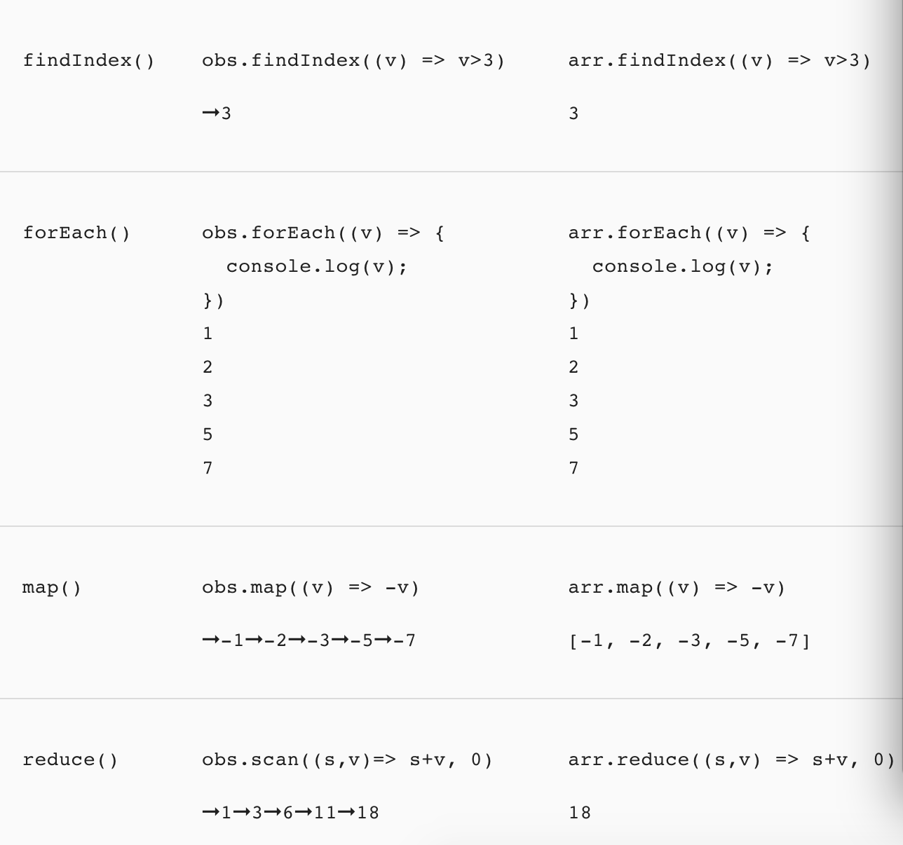

# rxjs-share

##  RxJS 简介
RxJS 是 Reactive Extensions for JavaScript 的缩写，起源于 Reactive Extensions，是一个基于可观测数据流在异步编程应用中的库。RxJS作为一个库(可以认为rxjs是处理事件的lodash)，可以和任何视图层框架混用。

## 先来看一个例子：类百度搜索功能

一般的实现方式是：监听文本框的输入事件，将输入内容发送到后台，最终将后台返回的数据进行处理并展示成搜索结果。
```
<input id="text"></input>
<script>
    var text = document.querySelector('#text');
    text.addEventListener('keyup', (e) =>{
        var searchText = e.target.value;
        // 发送输入内容到后台
        $.ajax({
            url: `search.qq.com/${searchText}`,
            success: data => {
              // 拿到后台返回数据，并展示搜索结果
              render(data);
            }
        });
    });
</script>
```
上面代码实现我们要的功能，但存在两个较大的问题：

多余的请求:
当想搜索“vue”时，输入框可能会存在三种情况，“v”、“vu”、“vue”。而这三种情况将会发起 3 次请求，存在 2 次多余的请求。

已无用的请求仍然执行:
一开始搜了“vue”，然后马上改搜索“Angular”。结果后台返回了“vue”的搜索结果，执行渲染逻辑后结果框展示了“vue”的结果，而不是当前正在搜索的“Angular”，这是不正确的。

减少多余请求数，可以用 setTimeout 函数节流的方式来处理，核心代码如下
```
<input id="text"></input>
<script>
    var text = document.querySelector('#text'),
        timer = null;
    text.addEventListener('keyup', (e) =>{
        // 在 250 毫秒内进行其他输入，则清除上一个定时器
        clearTimeout(timer);
        // 定时器，在 250 毫秒后触发
        timer = setTimeout(() => {
            console.log('发起请求..');
        },250)
    })
</script>
```
已无用的请求仍然执行的解决方式，可以在发起请求前声明一个当前搜索的状态变量，后台将搜索的内容及结果一起返回，前端判断返回数据与当前搜索是否一致，一致才走到渲染逻辑。最终代码为
```
<input id="text"></input>
<script>
    var text = document.querySelector('#text'),
        timer = null,
        currentSearch = '';
 
    text.addEventListener('keyup', (e) =>{
        clearTimeout(timer)
        timer = setTimeout(() => {
            // 声明一个当前所搜的状态变量
            currentSearch ＝ '书'; 
 
            var searchText = e.target.value;
            $.ajax({
                url: `search.qq.com/${searchText}`,
                success: data => {
                    // 判断后台返回的标志与我们存的当前搜索变量是否一致
                    if (data.search === currentSearch) {
                        // 渲染展示
                        render(data);
                    } else {
                        // ..
                    }
                }           
            });
        },250)
    })
</script>
```
上面代码基本满足需求，但代码开始显得乱糟糟。我们来使用 RxJS 实现上面代码功能，如下
```
var text = document.querySelector('#text');
var inputStream = Rx.Observable.fromEvent(text, 'keyup')
                    .debounceTime(250)
                    .pluck('target', 'value')
                    .switchMap(url => Http.get(url))
                    .subscribe(data => render(data));
```

##  RxJS · 流 Stream
学习 RxJS，我们需要从可观测数据流(Streams)说起，它是 Rx 中一个重要的数据类型。
流是在时间流逝的过程中产生的一系列事件，它具有时间与事件响应的概念。在前端领域中，DOM事件、WebSocket获得服务端的推送消息、AJAX获取服务端的数据资源（这个流可能只有一个数据）、网页动画显示等等都可以看成是数据流。


下雨天时，雨滴随时间推移逐渐产生，下落时对水面产生了水波纹的影响，这跟 Rx 中的流是很类似的。而在 Web 中，雨滴可能就是一系列的鼠标点击、键盘点击产生的事件或数据集合等等。

适用场景：1.异步操作重，2.同时处理多个数据源。

## Observable 和 Observer
* Observable (可观察对象): 表示一个概念，这个概念是一个可调用的未来值或事件的集合。
* Observer (观察者): 一个回调函数的集合，它知道如何去监听由Observable 提供的值。
### Observable 剖析
Observables 是使用 Rx.Observable.create 或创建操作符创建的，并使用观察者来订阅它，然后执行它并发送 next / error / complete 通知给观察者，而且执行可能会被清理。这四个方面全部编码在 Observables 实例中，但某些方面是与其他类型相关的，像 Observer (观察者) 和 Subscription (订阅)。

Observable 的核心关注点：

* 创建 Observables
* 订阅 Observables
* 执行 Observables
* 清理 Observables

#### 创建可观察对象Observable
* 通过构造函数
```
import { Observable } from 'rxjs';

function sequenceSubscriber(observer) {
    // 执行Observable
  observer.next(1);
  observer.next(2);
  observer.next(3);
  observer.complete();
  return {unsubscribe() {}};
}
const sequence = new Observable(sequenceSubscriber);
```
* from方法 (Promise | ArrayLike | Iterable)
```
import { from } from 'rxjs';

const data = from(fetch('/api/endpoint'));
```
* fromEvent方法 （The DOM EventTarget, Node.js EventEmitter, JQuery-like event target, NodeList or HTMLCollection to attach the event handler to）
```
import { fromEvent } from 'rxjs';

let socket$ = fromEvent(new WebSocket('ws://localhost:8081'));
// 可以发送消息给服务端
socket$.next(JSON.stringify({ op: 'hello' }));
```
* of、interval等等都可以创建一个Observable对象

#### 订阅 Observables
```
observable.subscribe({
  next: x => console.log('Observer got a next value: ' + x),
  error: err => console.error('Observer got an error: ' + err),
  complete: () => console.log('Observer got a complete notification'),
})
```
#### 执行 Observables
Observable.create(function subscribe(observer) {...}) 中...的代码表示 “Observable 执行”，它是惰性运算，只有在每个观察者订阅后才会执行。随着时间的推移，执行会以同步或异步的方式产生多个值。

Observable 执行可以传递三种类型的值：

"Next" 通知： 发送一个值，比如数字、字符串、对象，等等。
"Error" 通知： 发送一个 JavaScript 错误 或 异常。
"Complete" 通知： 不再发送任何值。
"Next" 通知是最重要，也是最常见的类型：它们表示传递给观察者的实际数据。"Error" 和 "Complete" 通知可能只会在 Observable 执行期间发生一次，并且只会执行其中的一个。

这些约束用所谓的 Observable 语法或合约表达最好，写为正则表达式是这样的：

next*(error|complete)?
```
var observable = Rx.Observable.create(function subscribe(observer) {
  observer.next(1);
  observer.next(2);
  observer.next(3);
  observer.complete();
  observer.next(4); // 因为违反规约，所以不会发送
});
```
#### 清理 Observable 执行
```
var observable = Rx.Observable.create(function subscribe(observer) {
  // 追踪 interval 资源
  var intervalID = setInterval(() => {
    observer.next('hi');
  }, 1000);

  // 提供取消和清理 interval 资源的方法
  return function unsubscribe() {
    clearInterval(intervalID);
  };
});
var unsubscribe = observable.subscribe({next: (x) => console.log(x)});
unsubscribe(); // 清理资源
```
### Observer (观察者)
什么是观察者？ - 观察者是由 Observable 发送的值的消费者。观察者只是一组回调函数的集合，每个回调函数对应一种 Observable 发送的通知类型：next、error 和 complete 。下面的示例是一个典型的观察者对象：
```
var observer = {
  next: x => console.log('Observer got a next value: ' + x),
  error: err => console.error('Observer got an error: ' + err),
  complete: () => console.log('Observer got a complete notification'),
};
```
要使用观察者，需要把它提供给 Observable 的 subscribe 方法：
```
observable.subscribe(observer);
```
简写，只有next选项的Observer
```
observable.subscribe(x => console.log('Observer got a next value: ' + x));
```

## 可观察对象与其它技术的比较
你可以经常使用可观察对象（Observable）而不是承诺（Promise）来异步传递值。 类似的，可观察对象也可以取代事件处理器的位置。最后，由于可观察对象传递多个值，所以你可以在任何可能构建和操作数组的地方使用可观察对象。

### 可观察对象 vs. 承诺
可观察对象经常拿来和承诺进行对比。有一些关键的不同点：

* 可观察对象是声明式的，在被订阅之前，它不会开始执行。承诺是在创建时就立即执行的。这让可观察对象可用于定义那些应该按需执行的菜谱。

* 可观察对象能提供多个值。承诺只提供一个。这让可观察对象可用于随着时间的推移获取多个值。

* 可观察对象会区分串联处理和订阅语句。承诺只有 .then() 语句。这让可观察对象可用于创建供系统的其它部分使用而不希望立即执行的复杂菜谱。

* 可观察对象的 subscribe() 会负责处理错误。承诺会把错误推送给它的子承诺。这让可观察对象可用于进行集中式、可预测的错误处理。

下列代码片段揭示了同样的操作要如何分别使用可观察对象和承诺进行实现。


### 可观察对象 vs. 事件 API
可观察对象和事件 API 中的事件处理器很像。这两种技术都会定义通知处理器，并使用它们来处理一段时间内传递的多个值。订阅可观察对象与添加事件处理器是等价的。一个显著的不同是你可以配置可观察对象，使其在把事件传给事件处理器之间先进行转换。


使用可观察对象来处理错误和异步操作在 HTTP 请求这样的场景下更加具有一致性。

下列代码片段揭示了同样的操作要如何分别使用可观察对象和事件 API 进行实现。

### 可观察对象 vs. 数组

可观察对象会随时间生成值。数组是用一组静态的值创建的。某种意义上，可观察对象是异步的，而数组是同步的。 在下列例子中，➞ 符号表示异步传递值。




### Subject (主体)

* Cold数据流
所谓Cold Observable，就是每次被subscribe都产生一个全新的数据序列的数据流，如下：
```
const { interval } = require('rxjs')
const { take } = require('rxjs/operators')

const tick$ = interval(1000).pipe(
  take(3)
)

tick$.subscribe(v => console.log(`observable 1: ${v}`))

setTimeout(() => {
  tick$.subscribe(v => console.log(`observable 2: ${v}`))
}, 2000)

// observable 1: 0
// observable 1: 1
// observable 2: 0
// observable 1: 2
// observable 2: 1
// observable 2: 2
```
* Hot数据流--Subject
无论被订阅多少次，推送给Observer的都是一样的数据源。例如：鼠标的点击事件、WebSocket的推送消息、Node.js支持的EventEmitter对象消息等等
#### Subject的两面性
* 每个 Subject 都是 Observable 。 - 对于 Subject，你可以提供一个观察者并使用 subscribe 方法，就可以开始正常接收值。从观察者的角度而言，它无法判断 Observable 执行是来自普通的 Observable 还是 Subject
* 每个 Subject 都是观察者。 - Subject 是一个有如下方法的对象： next(v)、error(e) 和 complete() 。要给 Subject 提供新值，只要调用 next(theValue)，它会将值多播给已注册监听该 Subject 的观察者们
```
import { Subject } from 'rxjs'

var subject = new Subject()

subject.subscribe({
  next: (v) => console.log('observerA: ' + v)
})
subject.subscribe({
  next: (v) => console.log('observerB: ' + v)
})

subject.next(1)
subject.next(2)
```

### Operators (操作符)
操作符是 Observable 类型上的方法，比如 .map(...)、.filter(...)、.merge(...)，等等。当操作符被调用时，它们不会改变已经存在的 Observable 实例。相反，它们返回一个新的 Observable ，它的 subscription 逻辑基于第一个 Observable 。

操作符本质上是一个纯函数 (pure function)，它接收一个 Observable 作为输入，并生成一个新的 Observable 作为输出。订阅输出 Observable 同样会订阅输入 Observable 。
#### 实例操作符 vs. 静态操作符
* 绝大多数都是实例操作符
* 最常用的静态操作符类型是所谓的创建操作符
#### 常用的操作符

类别|操作
-|-
创建|from , fromEvent , of , interval
组合|combineLatest , concat , merge , startWith , withLatestFrom , zip
过滤|debounceTime , distinctUntilChanged , filter , take , takeUntil
转换|bufferTime , concatMap , map , mergeMap , scan , switchMap
工具|tap
多播|share
#### 组合操作符
* concat 首尾相连，只支持同步数据
```
const { of } = require('rxjs')
const { concat } = require('rxjs/operators')

const ob$1 = of(1, 2, 3)
const ob$2 = of(4, 5, 6)

ob$1.pipe(
  concat(ob$2)
).subscribe(v => console.log(v))

// 1, 2, 3, 4, 5, 6
```
* merge 先到先得快速通过
```
const { timer } = require('rxjs')
const { merge, map } = require('rxjs/operators')
* zip 将多个 Observable 组合以创建一个 Observable，该 Observable 的值是由所有输入 Observables 的值按顺序计算而来的。如果最后一个参数是函数, 这个函数被用来计算最终发出的值.否则, 返回一个顺序包含所有输入值的数组
```
 const { of, zip } = require('rxjs')

const age$ = of(27, 25, 29)
const name$ = of('Foo', 'Bar', 'Beer')
const isDev$ = of(true, true, false)

zip(age$,
    name$,
    isDev$,
    (age, name, isDev) => ({ age, name, isDev }))
.subscribe(x => console.log(x))

// 输出：
// { age: 27, name: 'Foo', isDev: true }
// { age: 25, name: 'Bar', isDev: true }
// { age: 29, name: 'Beer', isDev: false }
```

// timer在初始延时之后开始发送并且在每个时间周期后发出自增的数字。
const ob$1 = timer(0, 1000).pipe(
  map(v => v + 'A')
)
const ob$2 = timer(500, 1000).pipe(
  map(v => v + 'B')
)

ob$1.pipe(
  merge(ob$2)
).subscribe(v => console.log(v))

// 0A
// 0B
// 1A
// 1B
// ....
```
#### 自定义操作符
我们创建一个自定义操作符函数，它将从输入 Observable 接收的每个值都乘以10：
```
const { Observable, from } = require('rxjs')

function multiplyByTen(input) {
  var output = new Observable(function subscribe(observer) {
    input.subscribe({
      next: (v) => observer.next(10 * v),
      error: (err) => observer.error(err),
      complete: () => observer.complete()
    })
  })
  return output
}

var input = from([1, 2, 3, 4])
var output = multiplyByTen(input)
output.subscribe(x => console.log(x))
```

### 异常处理 (catchError, retry, retryWhen)
* catchError 捕获
```
const { range, of } = require('rxjs')
const { catchError, map } = require('rxjs/operators')

const range$ = range(1, 5)
const throwUnluckyNumber = v => {
  if (v === 4) throw new Error('不幸运的数字')
  return v
}
range$.pipe(
  map(throwUnluckyNumber),
  catchError(e => of('新的Observable'))
).subscribe(v => console.log(v))
```
* retry 重试
```
const { from, range, of, interval } = require('rxjs')
const { catchError, retry, map, switchMap } = require('rxjs/operators')

const range$ = range(1, 5)
const throwUnluckyNumber = v => {
  if (v === 4) throw new Error('不幸运的数字')
  return v
}
range$.pipe(
  map(throwUnluckyNumber),
  retry(2),
  catchError(e => of('新的Observable'))
).subscribe(v => console.log(v))

// 重试Promise
let times = 1
const observable$ = of(1)
const fetchPromise = function () {
  console.log(times++)
  return new Promise((resolve, reject) => {
    setTimeout(() => {
      reject(new Error('来自Promise的错误'))
    }, 1000)
  })
}

observable$.pipe(
  switchMap(num => from(fetchPromise())),
  retry(3),
  catchError(e => of('catchError'))
).subscribe({
  next: boo => console.log(boo),
  error: e => console.log(e)
})

```
* retryWhen 有节奏的重试，接收一个function，return一个Observable
```
const { range, of, interval } = require('rxjs')
const { catchError, retryWhen, map } = require('rxjs/operators')

const range$ = range(1, 5)
const throwUnluckyNumber = v => {
  if (v === 4) throw new Error('不幸运的数字')
  return v
}
range$.pipe(
  map(throwUnluckyNumber),
  retryWhen(err$ => interval(1000)), // 每隔一秒重试，无限
  catchError(e => of('新的Observable'))
).subscribe(v => console.log(v))
```
### 应用场景
优点：
* 对前端的异步编程做了统一，提供一致的API
* 强大的操作符能够简化异步操作，提升代码的简洁性
* rxjs6.0对模块化做了优化，更好的支持webpack的tree-shaking

缺点：
* 学习曲线陡峭，相关文档介绍少，大多资料都停留在v5版本，需要踩坑
* 并不是所有场景都适合，盲目引入会徒增项目的复杂性

适用场景：异步操作繁杂，多数据源

参考1：[流动的数据——使用 RxJS 构造复杂单页应用的数据逻辑](https://zhuanlan.zhihu.com/p/23305264)

参考2：[DaoCloud 基于 RxJS 的前端数据层实践](https://zhuanlan.zhihu.com/p/28958042)
* 异步操作繁杂，多数据源
* Angular2+ 重度依赖rxjs
* vue-rx vue与rxjs结合


## RxJS 基础实现原理简析
对流的概念有一定理解后，我们来讲讲 RxJS 是怎么围绕着流的概念来实现的，讲讲 RxJS 的基础实现原理。RxJS 是**基于观察者模式和迭代器模式以函数式编程思维**来实现的。

### 观察者模式
观察者模式在 Web 中最常见的应该是 DOM 事件的监听和触发。

* 订阅：通过 addEventListener 订阅 document.body 的 click 事件。
* 发布：当 body 节点被点击时，body 节点便会向订阅者发布这个消息。


### 迭代器模式
迭代器模式可以用 JavaScript 提供了 Iterable Protocol 可迭代协议来表示。Iterable Protocol 不是具体的变量类型，而是一种可实现协议。JavaScript 中像 Array、Set 等都属于内置的可迭代类型，可以通过 iterator 方法来获取一个迭代对象，调用迭代对象的 next 方法将获取一个元素对象，如下示例。

```
var iterable = [1, 2];
 
var iterator = iterable[Symbol.iterator]();
 
iterator.next(); // => { value: "1", done: false}
iterator.next(); // => { value: "2", done: false}
 
iterator.next(); // => { value: undefined, done: true}
```

元素对象中：value 表示返回值，done 表示是否已经到达最后。

遍历迭代器可以使用下面做法。

```
var iterable = [1, 2];
var iterator = iterable[Symbol.iterator]();
 
while(true) {
    let result;
    try {
        result = iterator.next();  // <= 获取下一个值
    } catch (err) {
        handleError(err);  // <= 错误处理
    }
    if (result.done) {
        handleCompleted();  // <= 无更多值（已完成）
        break;
    }
    doSomething(result.value);
}
```
主要对应三种情况：

* 获取下一个值: 调用 next 可以将元素一个个地返回，这样就支持了返回多次值。

* 无更多值(已完成): 当无更多值时，next 返回元素中 done 为 true。

* 错误处理: 当 next 方法执行时报错，则会抛出 error 事件，所以可以用try catch 包裹 next 方法处理可能出现的错误。

## 异步编程
* callback
* Promise
* Generator
* async/await